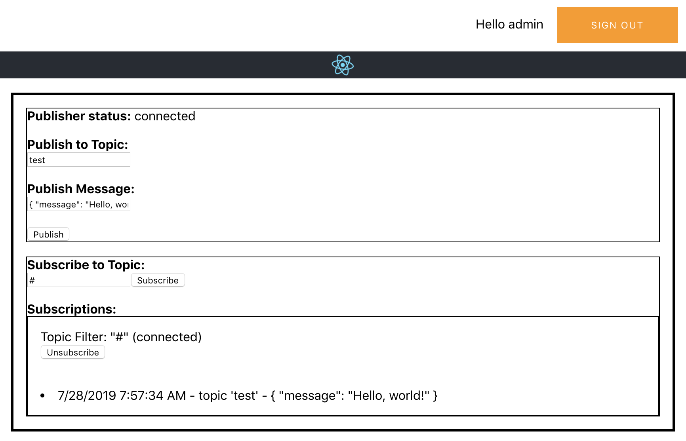
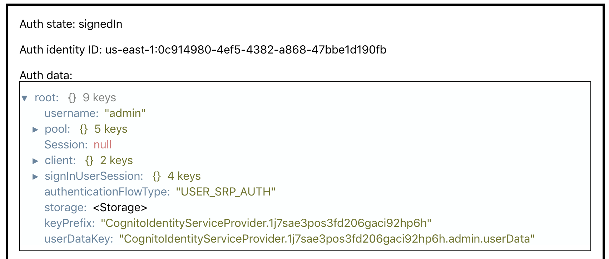

# aws-amplify-react-template

## Update

I've since made what I feel is a cleaner UI, better code, and other features (not just AWS IoT) in this project:
https://github.com/matwerber1/aws-amplify-react-toolkit

The project above is probably an easier way to do things and I recommend it over this project.

## Overview

This is a very basic AWS Amplify + AWS IoT Javascript SDK + React project that combines basic authentication via Amazon Cognito with AWS IoT Core pubsub via the aws-iot-device-sdk to (1) authenticate via Cognito, (2) subscribe to one or more topics and (3) publish messages to a user-specified topic. 

The functionality is similar to (though simpler, less pretty) version of the "Test" tab in the AWS IoT console:

## Screenshots




## Deployment with Amplify Console (website hosted by AWS)

**JULY 2020 NOTE** the Amplify Console docs below are missing the part where I walk you threw updating `src/aws-iot-configuration.js`, which is needed so the website knows which AWS IoT endpoint and Cognito Identity pool to use. Refer to the new (updated) "Local Deployment" steps for a working guide. If you wanted to use that with the hosted Amplify Console, you'd need to clone this project, update the `aws-iot-configuration.js` file, then publish the project to your own GitHub repository before following the steps below.

1. Navigate to the [Amplify Console Home Page](https://console.aws.amazon.com/amplify/home)

2. Choose "Connect App" and link to the [https://github.com/matwerber1/aws-amplify-react-template](https://github.com/matwerber1/aws-amplify-react-template) GitHub repo. 

3. Deploy the app from the Amplify Console

4. Once app completes, navigate to app endpoint (as shown in Amplify console), and create yourself a new user.

5. Log in to the endpoint (as shown in Amplify Console) with your newly-created user. 

6. Make note of the "Auth Identity ID".

7. Per instructions in [manual-steps.md](./manual-steps.md), create a new IoT policy named "ReactIotPolicy".

8. Per instructions in [manual-steps.md](./manual-steps.md), issue CLI command to grant your user's auth identity ID (Step 6) access to the new IoT policy (Step 7). 

9. Per instructions in [manual-steps.md](./manual-steps.md), edit your authorized users' IAM role to have permission to connect/publish/subscribe to AWS IoT. 

10. That *should* be it!

##  Local Deployment (website on localhost)

1. Clone the repo

  ```sh
  git clone https://github.com/matwerber1/aws-amplify-react-iot-pub-sub-demo
  ```

2. move to project root

  ```sh
  cd aws-amplify-react-iot-pub-sub-demo
  ```

3. Install dependencies

```sh
npm install
```

2. Initialize Amplify

  ```sh
  amplify init
  ```

3. Push / create your backend

  ```
  amplify push
  ```


4. Navigate to the [AWS IoT web console](https://console.aws.amazon.com/iot/home?) and:

  1. Click **Settings** in the lower left, and copy your **Endpoint** to a text file; you'll need this later. It would look similar to below:

    ```
    a2mvse68411234-ats.iot.us-west-2.amazonaws.com
    ```

5. Navigate to the [Cognito Co thensole](https://console.aws.amazon.com/cognito/home?) and:

  1. Click **Manage Identity Pools** (not user pools)
  2. Click the pool name for your app, it should look similar to `cognito81d9f49f_identitypool_81d9f49f__dev`
  3. Copy the **Sample Code** link on left, and in the code example, copy your **Identity Pool ID** to a text file; you'll need this later. It will look like `us-west-2:970761d2-56b8-4057-9eb6-f7e01cd9ade6`

2. Open `src/aws-iot-configuration.js` and:

  1. set the **endpoint** to the value from above. Be sure to prefix the endpoint value with `wss://` (for websockets) and add a suffix of `/mqtt`, as in the example below. 
  
  2. Set the **host** to the endpoint value as-is.
  
  3. Specify your AWS **region**

  4. Set the pool ID to the Cognito Pool ID you gathered from above. 

  ```js
  // src/aws-iot-configuration.js
  var awsIotConfiguration = {
    endpoint: 'wss://a2mvse6841elo7-ats.iot.us-west-2.amazonaws.com/mqtt', 
    region: 'us-west-2',
    poolId: 'us-west-2:970761d2-56b8-4057-9eb6-f7e01cd9ade6',
    host: 'a2mvse6841elo7-ats.iot.us-west-2.amazonaws.com'
  };
  ```

5. Navigate to the [AWS IoT Security Policy web console](https://console.aws.amazon.com/iot/home?/policyhub#/policyhub) and:

  1. Click **Create Policy**
  2. Give the policy a name like `ReactIoTPolicy`
  3. Click **Advanced Mode**
  4. Paste in the following policy:

    ```json
    {
      "Version": "2012-10-17",
      "Statement": [
        {
          "Effect": "Allow",
          "Action": "iot:*",
          "Resource": "*"
        }
      ]
    }
    ```
  5. Click **Create**

6. Using the Cognito Identity ID from earlier, run the following AWS CLI command:

  ```sh
  aws iot attach-principal-policy --policy-name 'ReactIoTPolicy' --principal '<YOUR_COGNITO_IDENTITY_ID>'
  ```

  It would look like:

  ```sh
  aws iot attach-principal-policy --policy-name 'ReactIoTPolicy' --principal 'us-west-2:d8b273d6-8d18-4fe7-81df-7d2ddd77587a'
  ```

7. Navigate to the [AWS IAM Console](https://console.aws.amazon.com/iam/home?#/roles) and search for the IAM role for your authorized Cognito Identity pool users. It will have a name similar to `arn:aws:iam::123456790:role/amplify-awsamplifyreacttempl-dev-115859-authRole` and have a creation time that matches the date your deploying this project. Be sure to select the `authRole`, not the `unauthRole`

  1. Click **Attach Policies**
  2. Search for and select the `AWSIoTFullAccess` policy

4. Run the website locally

  ```
  npm run start
  ```

5. Navigate to `localhost:8080`, sign up, and test!
